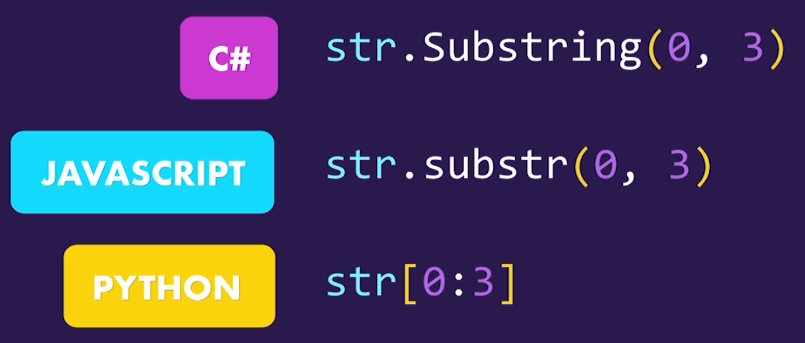
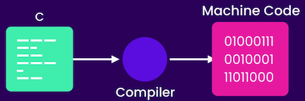
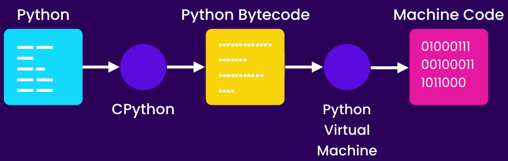
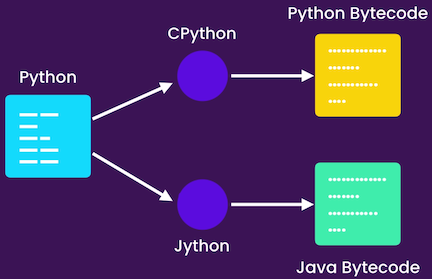

# My Note for Python

### Getting started

* What is the python?
  * The world's fastest growing Programming language
  * Software developers - Mathematicians - Data Analysts - Scientists - Accountants - Network Engineers - Kids
  * Solve very complex problems with fewer lins of code
  *  
  *  A multi purpose language : Data analysis, AI/ML, Automation, Web Apps, Mobile Apps, Desktop Apps, Testing, Hacking
  *  Most desireable language : High level, Cross platform, Huge community, large ecosystem
  *  Python 2 and Python 3

* How to Install?
  * Download and install
  * Check in CMD python3 vs python2
* Python Interpreter 
  * Check Some Rules and code in it
  * Math, Logical
  * Syntax means Grammar
* Code Editors
   * Editors(Atom, Vscode, Vim, Sublime) & IDE (PyCharm)
 * First Python Code
   * .py extension 
   * Built-in Functions like print()
   * Terminal -> Command or control + `
   * Check some Print code
 * Python Extension
   * To Convert VsCode to A powerful IDE
   * 
   * Python extension
   * Linter (pylint)
   * Choose Python interpreter from bottom
 * Linting Python Code
   * Test print Without ()
   * Check some syntax error
   * Indentation of python
   * Python comments
   * Command palette view or (Command / control + shift + p)
* Formatting Code 
  * Python Enhancement Proposals (PEP8)
  * Python peps in Google
  * Command pallet => Format Document and install Auto PEP8
  * X=1 ===> X = 1 and Three variable
  * Auto Format on Save : Preferences->Settings->FormatOnSave
* Running Python Code
   * Install code Runner (Extensions)
   * Code-runner.executermap
 * Python Implementation
   * cPython -> jython(java)-ironPython(C#)-PyPy
   * If you're Java developer and want to use java code in python you should use jython
 * How Python code is executed?
    * 
    * Different CPUs = Different machine code
    * Java Solve This Problem
    * 
    * How jython works
    * 
    * Quiz : Ask about Linter / PEP8
 

 

### Primitive Types

* Variables
    * Memory and memorizing Variables in computers
    * Built-in primitive types (Numbers, Booleans, Strings)
    * Numbers (Integer, Float) / Booleans (True/False) / Strings("text")
* Variable Names
    * Being descriptive and meaningful
    * Lowercase Letters 
    * Use underscore
    * Don't start with numbers
    * Space around the equal sign
* Strings
    * Single, Double, and Triple quote.
    * Built-in Functions like len(Argument)<- to call
    * Strings as an array str[0][-1][0:3][0:][:3][:] 
* Escape Sequences
    * str = "Course\"s problem"
    * \", \', \\, \n
* Formatted Strings
    * first="Ali" and last="D" formatted=f"{first} {last}" print(first+" " + last)
    * Concatenation +
    * Comments in Python #
* String Methods
    * Differences between methods and functions
    * Tell about functions and how it works with example
    * python is case sensitive language
    * saving in memory and original data doesn't change with example
    * Tell about the way of saving strings as array.
    * len()
    * .upper()
    * .lower()
    * .title()
    * .strip() /lstrip() or rstrip()
    * .find("pro") / -1 for "Pro"
    * .replace("", "")
    * "pro" in course
    * "pro" not in course
* Numbers
    * Integer, Float, Complex x = a + bi
    * Standard Arithmetic Operations(+-/*//%**)
    * augmented operators in python x+=1
* Working with Numbers
    * round()
    * abs()
    * math.ceil()
    * Python3 math modules in Google
* Type Conversion
    * input("x: ") run in Terminal and input a number
    * int(), float(), bool(), str()
    * type() use formatted string
    * all False values False, "", 0, None 
    * check boolean values in python interpreter  / " " is not False
    * quiz: what are the built-in primitive types in Python
    * quiz: fruit = "Apple" print(fruit[1])
    * quiz: 10 % 3 and bool("False")

 
 

 
 

 ### Control Flow

* Comparison Operators

   * Check som operators in python interpreter > < >= <= == != (10=="10")
   * numeric representation of characters
   * Check Comparison Operators on strings and ord()
* Conditional Statements
   * if statement and simple example ("if statement : pass")
   *  Talk about indentation and code block with example of three print under an if statement
   *  
   *  elif statement and else statement
   *  nested if statements
*  Ternary Operator
   * message = "OK" if time >= 10 else "Not OK"
*  Logical Operators
   * and / or / not simple example and avoid bool variable = True
   * bank example and lone
   * **if** (not condition1 or condition2) and condition:
*  Short-circuit evaluation 
   *  
   * separate statements using parentheses 
* Chaining Comparison Operators
   *  use comparison operators like math
   *   if 35 <= x < 98: **instead of** if x >= 35 and x< 98:
* Simple quiz
   * in app.py
* For Loops
   * for number in range(5)(1 , 6 , 2): print("Send" , number+1)
* For..else
   * else execute when a loop completely was executed.
   * 
* Nested Loops
   * Talk about Outer and inner Loops
   * Explain how exactly python interpreter execute nested loops
   * 
* Iterables
   * Use type for range() function to explain
   * range is complex type 
   * Iterable of strings or lists
* While Loops
   * Its repeat until a condition is exist or not changed
   * example of command prompt and quit()
* Infinite Loops
   * test it for while True: and use break and if to change it. and use a list of commands

### Functions
* Defining Functions
   * Reuseable chunks of code / built-in functions like print() / round() / range()
   *  Define a function using 'def' keyword
   *  Naming in functions follows all variables naming rules
   *  Two Lines break
* Arguments
   * Differences between arguments and parameters
   * An example for first_name and last_name
*  Types of functions
   * Functions that perform a task / functions that calculate and return a value
   * example for two type in real world and -> print() and round()
   * Greet() function in two type
   * 
   * All functions return None by default
*  Keyword Arguments
   * Saving info in invisible variable in python
   * Use keyword variables to make our code more readable 
   * 
   * Use keyword arguments when use a lot of variable to make it clear
 *  Default Arguments
   * We give default value to an argument and make it optional.
   * All optional parameters should come after required parameters.
   * You can not add another none optional parameter after last optional parameter.
 *  xargs
   * To send a collection of parameters to a function we use * before of one variable name like *number
   * *number convert our parameters to a iterable type named tuple
   * 
   * To send a collection of parameters to a function 
   * 
 *  xxargs
   * To send a collection of key value pair arguments to a function we use xxargs
   * 
*  Scope
   * Local variables doesn't work in outside of their scope
   * Example of the completely the same functions and different local variables
   * Global variables and avoid to use theme
   * 
   * We can use global keyword to use a global variable inside a function but we should avoid it.
   * Accidentally change in global variable inside a function can cause a side effect in other functions that use that variable.
   *  Debugging
   * To debug a python file open Run And Debug section first
   * Create lunch.json file into .vscode directory
   * Choose current active python file
   * Use F5 to run / F10 to Step over / F11 to step in / F9 to put a break point
   * In The left Side inside the variables section you can see variables value  at the moments
   * If you sure about a function and know its working properly Use Shift+F11 to step out of that
*  VSCode Coding Tricks
   * Press 'End' key to jump to the end of the line
   * Press 'home' key to jump to the beginning of the line
   * Press ctrl + 'Home' key to jump to the beginning of the file
   * Press ctrl + 'End' key to jump to the end of the file
   * To change the position of a line use 'Alt' + arrows 
   * To duplicate a line, choose that and press 'Alt' + 'Shift' + down arrow
   * Hold down Ctrl + 'slash' to convert a line to comment
   * Use some character of a variable or function name to use auto completion
### Data Structures
* Lists
   * A sequence of objects. one or two or More dimensional Lists
   * zeros = [0] * 100 / Use + to concatenate or * to multiply 
   * Use list() method to convert objects to list: num = list(range(20))
   * Use len() method to get length of a list
* Accessing Items
   * lst[0] , lst[-1]
   *  Use assign item to change list Items lst[1] = "B"
   *  Use [:] to get a range of items in list / [::2]
   *  Use [::-1] to reverse list(range(20))
* List Unpacking
   * first, second, third = lst / left and right must be equal in number
   * first, second, *other = lst / first, *other, last = lst
* Lopping Over List
   * Use for to loop over a list
   * enumerate() unpack list item to key and value
   * 
* Adding or Removing Items
   * Use .append() method to add an item to end of a list
   *  Use .insert() method to add item at specific position in list / lst.insert(1, "D")
   *  Use .pop() method to remove an item from end of a list / .pop() .pop(0)
   *  Use .remove("b") to remove first occurrence of that item / remove without index
   *  to remove all "b" in the list you should loop over list
   *  Use del lst[0] to delete an item or del lst[:3] to delete a range of items ==> this is difference between pop and del
   *  use lst.clear() to delete all items in the list.
* Finding Items
   * To find index of an item use lst.index("item")
   * .index() method return ValueError when try to find an item that is not exist.
   * Use if .. in .. to prevent this error
   * Use lst.count("item") to check existence of an item
* Sorting Lists
   * Use lst.sort(key, reverse=True|False) method to sort a list
   * To sort a list without changing the original list use sorted(lst) function / sorted(lst, reverse=True)
   * To sort a list of unordered items like list of tuples we should write a function and pass use sort item and pass all items to this function
 * Lambda Functions
   * A one line anonymous function we can pass to other functions
   * ... = lambda parameters:expression
   * 
  * Map Functions
   * Use mapping to map a list to make another better list
   * In ordinary way we define another list and append all second item to the new list
   * 
 * Filter Functions
   * To filter a list to a particular list contain some special items we use filter function
   * Regular way is looping over and separate elected items and add it to a new list
 * List Comprehension
   * "[expression for item in items] / [item[1] for item in lst]
   * To convert filtered list to comprehension do this: [item for item in lst if item[1] >= 10]
   * We can use if .. else statement in comprehension at first part of clause
* Zip Function
   * To combine two or more equal list (equal in list member) and make a new list, use zip function
   * Zip function return a tuple for each member contain all same index items
* Stacks
   * A LIFO data structure 
   * Website's pages visiting hierarchy is good simple fore Stack
   * We can use . append(), .pop() methods for simulating stack and stc[-1] and not stc to check it
* Queues
   * A FIFO data structure
   * We use deque for optimize Using queue
   * 
* Tuples
   * Tuple is a read only list and we use () to define it
   * if we remove () Python Assume it as tuple like 1, or 1,2
   * We can multiple or concatenate tuples
   * We can convert a list or any iterable into a Tuple using tuple()
   * We cannot mutate tuples and assign a value of tuple to a new value
* Swapping Variables
   * x, y = Y, x
   * This clause works as unpacking in tuples x, y = (11, 10)
* Arrays
   * If we deal with large sequence of numbers we should use Array
   * Array take less memory and work a little bit faster
   * For the using array we should import it
   * Array(typecode, iterable) 
   * All members in array should be the same type
* Sets
   * Set is a unordered collection of data without duplicates
   *  By converting a List to set we can remove all duplicates / set()
   *  
   *  Shining usage of sets is in mathematics
   *  To make union of Two sets print(set1 | st2) / print(set1 & st2) / print(set1 - st2) / print(set1 ^ st2)
   *  Sets items not in sequence and we cannot access them by index
   *  We can existence of a value by using if .. in statement
* Dictionaries
   * Dictionary is a key value per collection of data
   * In dictionary keys can only be an integer of string and value can be kind of anything
   * We can define a dictionary using dict() function
   *  
* Dictionary Comprehension
   * We can use Comprehension for sets and dictionaries
   * Val = {x : x*2 for x in range(5)}
* Generators
   * Generator object like list is a iterable but generate value in each iteration
   * Generators don't store all values in memory
   * 
   * Generators objects has no len
* Unpacking Operators
   * We can print Items of a list in unpacked using [*numbers]
   * 
   * We can use unpacking operators to combine lists
   * 
### Exceptions
* Exceptions
   * A Siple IndexError in list and ValueError in input method
* Handling Exceptions
   * Try / except clause 
   * 
   * Using as statement we can print the reason of exception
   * Use type to get info about error class
* Handling Different Exceptions
   * A simple error of Zero Division x = 10 / age
   * We can add more except clause to handel other kind of errors
   * Also we can put more error kind in front of except clause inside parentheses
* Cleaning Up
   * A finally clause always execute after a try/except clause
   * 
* The With Statement
   * With statement automatically release resources
   * 
   * Any kind of objects that have Context Management Protocol(CMP) in case of using with statement python automatically call __exit__() method for it
   * We can open multiple file using one with statement
* Raising Exceptions
   * We can write our function and get exceptions by raise statement
   * Try block can get our raise exception error as variable which we define
   * 
* Cost of Raising Exceptions
   * Using timeit library to calculate time
   * If we are building a simple app we can use raise exception and try block but in complex program with lots of processes or users it's better to handle problem without try or raise clauses.
### Classes
* Classes
   * A class is a blueprint or template that defines the structure and behavior of an object
   * An instance of a class. It represents a specific, unique occurrence of that class, with its own set of data and the ability to perform actions defined by the class
   * Classes form the building blocks for organizing and manipulating data in a comprehensive and organized manner, enabling efficient and reusable software development.
   * 
   * Text class in a social media as example
* Creating Classes
   * We follow Pascal naming rule in classes naming
   * We can define a object by calling a class and put it in a variable
   * By using isinstance() method we can check that an object is instance of a certain class
   * 
* Constructors
   * __init__ method is especial magic method that executed when a new object was creating.
   * self is reference to the current new object
   * Python create our new object and put it in memory and reference that in self statement.
   * An object has its own attributes that have data which related to it
   * For example human is class that have its attributes like eye color, skin color, hight, wight, and etc, and its functions like walking, jumping, eating, and etc
   * Python fill self variable automatically for us, when an object is creating.
   * We can use self to call this object attributes or functions or call foreign functions without it 
* Class vs Instance Attributes
   * We can define a new attribute for an object after creating it
   * Instance attributes belong to each object separately
   * Class level attributes are shared across all instances of a class 
   * 
* Class vs Instance Methods
   * When we create an instance of a class, we can use its functions as instance methods.
   * When we don't really need an existing object, but we need a particular function we can use class methods
   * In definition of class methods (factory method) we use 'cls' clause instead of 'self' and decorated it with '@classmethod', because its not belong to any specific object.
   * 
* Magic Methods
   * Magic methods called by python interpreter automatically
   * Search python3 magic methods in google
   * Use __str__ as example to convert variables to string
   * Print a object before define a __str__ method
   * 
* Comparing Objects
   * Equality operator compare the object references.
   * We should use python magic methods to represent a Comprehensible form of our class to user
   * 
   * If you implement a magic method python automatically figure out what to do if you use the other one.
* Supporting Arithmetic Operations
   * 
* Creating Custom Containers
   * We can define our custom Container using python built-in data structures like dictionary. 
   * 
* Private Members
   * We use double_underscore before of an attribute to make it private
   * A private member con't be accessed from the outside
   * Its tell user to be cautious about this attribute
   * We can access to all attributes of a class using __dict__() magic method
* Properties
   * We use properties to have control on class attributes
   * For example in product class for negative values we can use setter or getter method to perform it
   * 
   * To make a pythonic code we use property function and save it in class level attribute
   * 
   * Also we can decorate our setter and getter by property decorator and make cleaner code.
   * 
* Inheritance
   * Example of two class which have same methods
   * Avoid "DRY". it means: Don't Repeat Yourself
   * We can use inheritance or composition to solve this problem
   * Inheritance is a mechanism that allows us to define common behavior or common functions in one class and then inherit them in other classes
   * We use parentheses in front of a class name and write the parent class inside it to inherit all attributes and methods from Base class to Sub class
* The Object Class
   * Use isinstance() Method to reveal relationship between classes and object class
   * object class is base class for all classes in python
   * issubclass() method return True if a class is subclass of another class
* Method Overriding
   * When we use a subclass, some methods like constructor are overriding the Base class constructor
   * To change the sequence of call super() method we can change the position of method
   * 
* Multi-level Inheritance
   * Inheritance prevent code duplication and allows us to reuse code
   * Too much Inheritance between classes can increase complexity and introduce lots of issues
   * Remember, We should use multi-level inheritance in one or two level, not more.
* Multiple Inheritance
   * If You use multiple Inheritance not properly it's gonna be source of issues
   * In multiple Inheritance python interpreter, first look for greet() method in sub class and after that try to find it in multiple parents class in order from left to right
   * Multiple inheritance is a bad thing, just like multi-level inheritance, if you don't use it properly.
   * Before of using multiple inheritance, check that the parent classes should have the minimum subscription.
* A Good Example of Inheritance
   * A good Example of Inheritance on streaming from file and network in our web application.(code in app.py)
* Abstract Base classes
   * In our good example of inheritance, we have two serious problems: 1- We should built a sub class of Stream class and then use it 2- if we need to define a new sub class for Stream class, we should define read() method exactly like other sub stream classes.
   * In this case we should Covert Stream class to an abstract base class
   * first implementation : from abc import ABC, abstractmethod 
   * 
   * 
   * When a class is abstract method we con not make instance of it.
* Polymorphism
   * poly means Many, morphism means forms
   * By define a abstract method and concrete a method our functions can use many forms of classes automatically.
* Duck Typing
   * If something like duck and quacks like duck, it's a duck
   * Python is dynamically type language and it doesn't check the type of object.
   * if a certain method exist in object python accept it as abstract base method
* Extending Built-it Types
   * We can extend a built-in class like string class in python and give it more functionality by define a new class
   * 
   * to extend Lists : 
* Data Classes
   * Sometimes in Python codes, we encounter classes that have only data and do not show any behavior.
   * We can use id() method to print physical address of an object
   * We can use namedtuple library to define a class that have only data
   * 
   * namedtuples are immutable
### Modules
* Creating Modules
   * A real program can contain tens of thousand lines of code
   * We write python code in separate modules
   * Each module contain highly related objects (functions, variables, classes, etc.)
   * We can use objects in one file inside of another file by call theme by from ... import statement 
   * Using * to import all objects in a module can caused a overwriting and malfunction
   * If we used import statement only we should call objects by adding module name before of any object (sales.calc_tax())
* Compiled Python Files
   * When we import a module inside another module python after first time running code make a compiled version of module to speed up in code execution later
   * Name of the compiled file contain the version of cpython that used to execute this code
   * These files contain python bytecodes
* Module Search Path
   * 
* Packages
   * We we want to organize our python files in separate directories we should make packages
   * Add __init__.py file to a directory convert it to a python package
   * A package is container for one or more modules
   * 
* Sub-Packages
   * After add new directory we should add __init__ file
   * And make change in import statement
* Intra-packages References
   * To import a module inside another module of another package we can use absolute ot relative statement
   * Absolute import is better and PEP* recommend it
   * 
* The dir() Function
   * dir() is a built-function that show all methods inside a module
   * 
   * 
* Executing Modules as Script
   * When a module load for the first time all statement in it will be executed
   * The name of the module that starts our program is always __main__
   * After add "if __name__ == "__main__":" to a module when run in directly the the block code of it will be executed. but when imported it into another file this part of code will be ignored.
   * by this way we make this file useable as script as well as reuseable module that we can import into another module
### Python Standard Library
* Working With Path
   * After import path library we ca use it in different ways
   * 
   * search python 3 pathlibnin google
   * The most important members of this library is :
   * 
* Working With Directories
   * Important methods in Pathlib library for work with directories
   * 
   * We use iterdir() method to get list of files and directories in a particular directory
   * We use rglob() methd to fiand files based on a pattern
* Working With Files
   * Useful methods to working with files:
   * 
   * We can use shutel library to copy files instead of using read_text(_) or write_text() methods
   * 
* Working With ZIP and CSV Files
   * To work with zip file Use zipfile library
   * To work with CSV file Use csv library
   * csv is acronym for comma separated values
   * After importing csv module we use open built-in function to open a csv file
   * By using writer method we can built a csv file and write data in it
   * By using reader method we can read from a csv file and by using list method we can make a list of csv rows
* Working With JSON Files
   * JSON is javaScript Object Notation
   * We use JSON to format data in human readable way
   * To answer the requests that ask some data from your website you need to answer in JSON format
   * Note that dump and load convert between files and objects, while dumps and loads convert between strings and objects
* Working With SQLite Database
   * SQLite is very light weight Database that we use to store data of an application
   * We can use SQLite Database browser to manage our sqlite db file in visual (download from google)
   * We use connect method to create a new database or connect to an existent database
   * 
   * Insert data into database using a SQL INSERT query text
   * Read data from database using a SQL SELECT query text
   * When we try to read from database we'll get cursor
* Working With Timestamps
   * To work with time and date in python we can use to module (time, datetime)
   * Time module return timestamp and datetime module return an object that contain many attributes like year, moth, etc.
   * Start of timestamp in unix base systems is 1970-1-1 and timestamp demonstrate all seconds from that time
   * 
* Working With DatetTimes
   * DateTime object can convert a date time to python object
   * DateTime can show current date time by method now()
   * DataTime object can convert strings to real datetime by strptime() method (by using a pattern like ("%Y/%m/%d"))
   * Search Python 3 Strptime in google
   * DataTime object can convert datetime object to string by strftime() method
   * we can compare datetime objects
* Generating Random Values
   * We can make random values by using random module
   * 
   * We use 'string' module to give choices method all ascii letters and numbers to generate a good password
### Python Package Index
* Pypi
   * There are times that we need features that not implemented in the Python standard libraries
   * We use Pypi(Python Packaging Index) to import lots of useful libraries to our program
   * Visit pypi.org and search on it to find your desireable package
   * Search in google = "Best python packages for working with ..."
* Pip
   * We use tool named pip to manage our packages
   * use pip install "package-name" to install a package
   * we can use "pip list to check our installed packages"
   * Check a package like requests in pypi.org
   * By adding "==" and the a specific version we can install an earlier or older version of a package(requests==2.9.*)
   * use pip uninstall "package-name" to uninstall a package
   * import an installed packages in python file as example
   * 
* Virtual Environments
   * When we need to work with 2 different version of a package in two separated project simultaneously we should create a virtual environment for each of them
   * By "python -m venv env" we make a virtual environment for our project
   * Our packages would be installed inside the site-packages directory
   * In windows to active the virtual environment we should :
   * 
   * We use "deactivate" command to deactivate venv
* Pipenv
   * Pipenv is tool that combine pip with virtual environment to a single tool
   * Install pipenv using pip first
   * To install packages using pipenv we use pipenv instead of pip in pip install command
   * We can locate our new virtual environment by command: "pipenv --venv"
   * We activate our virtual environment by this command : "pipenv shell" and deactivate it by "exit"
   *  In vs code we need some configuration to use pipenv
   *  "pydoc3 math" show the documentation of math library.